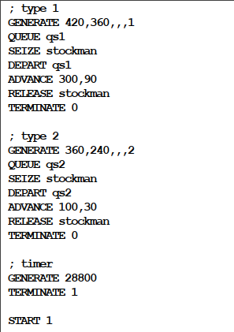
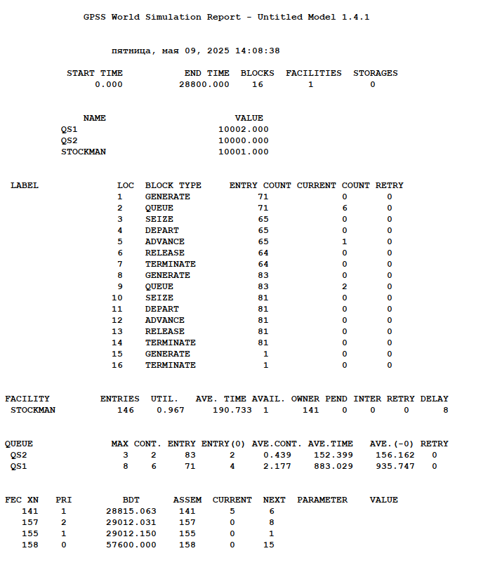
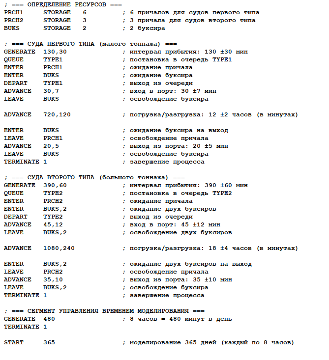
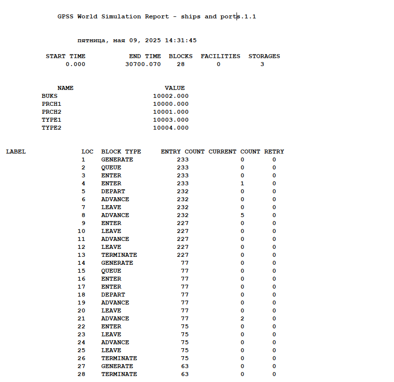
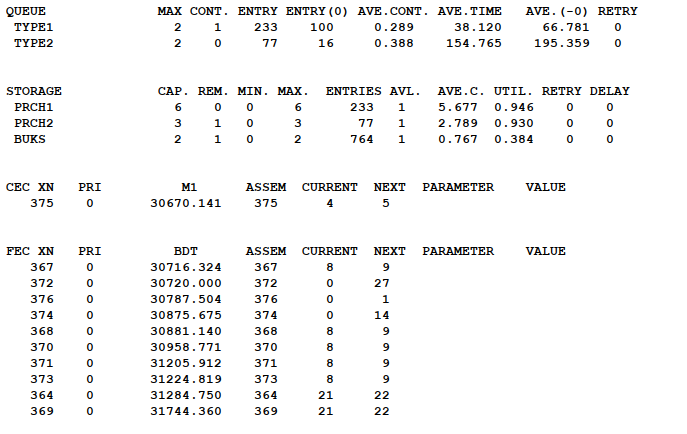

---
## Front matter
lang: ru-RU
title: Лабораторная работа №15
subtitle: Модели обслуживания с приоритетами
author:
  - Лихтенштейн А.А.
institute:
  - Российский университет дружбы народов, Москва, Россия

## i18n babel
babel-lang: russian
babel-otherlangs: english

## Formatting pdf
toc: false
toc-title: Содержание
slide_level: 2
aspectratio: 169
section-titles: true
theme: metropolis
header-includes:
 - \metroset{progressbar=frametitle,sectionpage=progressbar,numbering=fraction}
---

# Информация

## Докладчик

:::::::::::::: {.columns align=center}
::: {.column width="60%"}

  * Лихтенштейн Алина Алексеевна
  * студентка
  * Российский университет дружбы народов
  * 1132229533@pfur.ru
  * <https://aaliechtenstein.github.io/ru/>

:::
::: {.column width="25%"}

:::
::::::::::::::

# Вводная часть

## Цели и задачи

Выполнить моделирование обслуживания с приоритетами и провести анализ результатов.

## Задание

Реализовать с помощью gpss:

- Модель обслуживания механиков на складе.
- Модель обслуживания в порту судов двух типов.

## Модель обслуживания механиков на складе

{#fig:001 width=30%}

## Отчёт по модели обслуживания механиков на складе

{#fig:002 width=40%}

## Модель обслуживания в порту судов двух типов

{#fig:003 width=40%}

## Отчёт по модели обслуживания в порту судов двух типов

{#fig:004 width=40%}

## Отчёт по модели обслуживания в порту судов двух типов

{#fig:005 width=40%}

# Результаты

В ходе данной лабораторной работы было выполнено моделирование обслуживания с приоритетами и проведен анализ результатов
