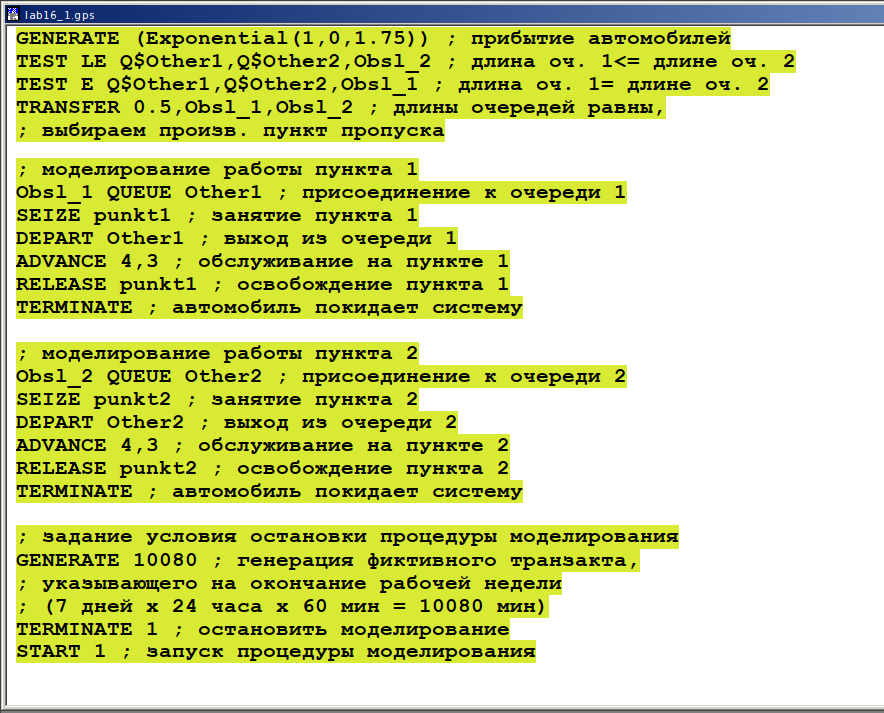
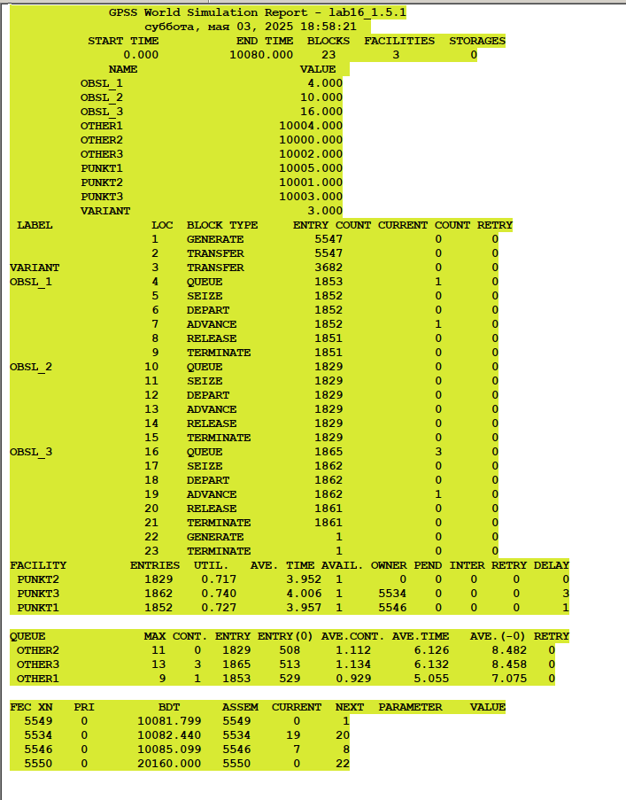
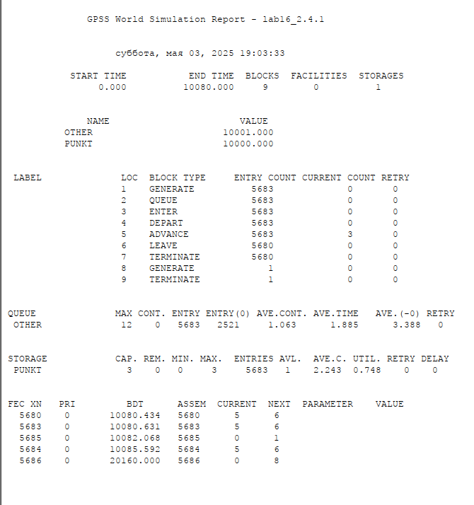
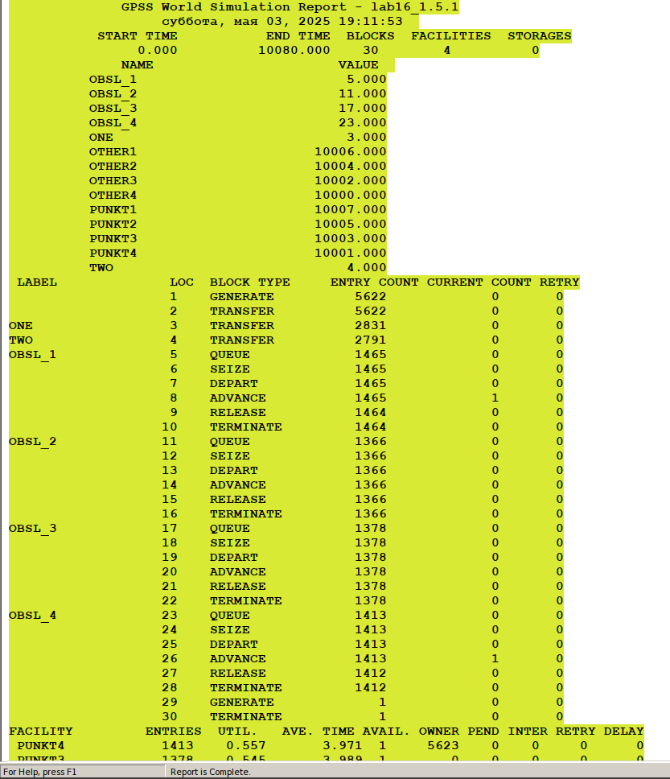
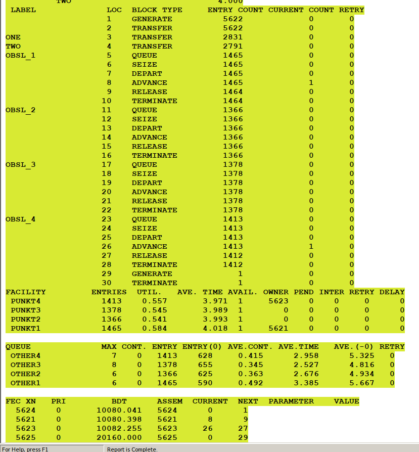

---
## Front matter
lang: ru-RU
title: Лабораторная работа №16
subtitle: Задачи оптимизации. Модель двух стратегий обслуживания
author:
  - Лихтенштейн А.А.
institute:
  - Российский университет дружбы народов, Москва, Россия

## i18n babel
babel-lang: russian
babel-otherlangs: english

## Formatting pdf
toc: false
toc-title: Содержание
slide_level: 2
aspectratio: 169
section-titles: true
theme: metropolis
header-includes:
 - \metroset{progressbar=frametitle,sectionpage=progressbar,numbering=fraction}
---

# Информация

## Докладчик

:::::::::::::: {.columns align=center}
::: {.column width="60%"}

  * Лихтенштейн Алина Алексеевна
  * студентка
  * Российский университет дружбы народов
  * 1132229533@pfur.ru
  * <https://aaliechtenstein.github.io/ru/>

:::
::: {.column width="25%"}

:::
::::::::::::::

# Вводная часть

## Цель 

Реализовать с помощью gpss модель двух стратегий обслуживания и оценить оптимальные параметры.

## Задание

Реализовать с помощью gpss:

- модель с двумя очередями;
- модель с одной очередью;
- изменить модели, чтобы определить оптимальное число пропускных пунктов.

## Модель первой стратегии обслуживания (2 пункта)

{#fig:001 width=40%}

## Отчёт по модели первой стратегии обслуживания (2 пункта)

{#fig:002 width=30%}

## Модель второй стратегии обслуживания (2 пункта)

{#fig:003 width=40%}

## Отчёт по модели второй стратегии обслуживания (2 пункта)

{#fig:004 width=40%}

## Сравнение

: Сравнение стратегий

| Показатель                 | стратегия 1 |         |          |  стратегия 2 |
|----------------------------|-------------|---------|----------|--------------|
|                            | пункт 1     | пункт 2 | в целом  |              |
| Поступило автомобилей      | 2928        | 2925    | 5853     | 5719         |
| Обслужено автомобилей      | 2540        | 2536    | 5076     | 5049         |
| Коэффициент загрузки       | 0,997       | 0,996   | 0,9965   | 1            |
| Максимальная длина очереди | 393         | 393     | 786      | 668          |
| Средняя длина очереди      | 187,098     | 187,114 | 374,212  | 344,466      |
| Среднее время ожидания     | 644,107     | 644,823 | 644,465  | 607,138      |

## Модель с одним пропускным пунктом (обе стратегии)

{#fig:005 width=40%}

## Отчёт по модели с одним пропускным пунктом (обе стратегии)

{#fig:006 width=40%}

## Модель первой стратегии обслуживания (3 пункта)

{#fig:007 width=40%}

## Отчёт по модели первой стратегии обслуживания (3 пункта)

{#fig:008 width=40%}

## Модель второй стратегии обслуживания (3 пункта)

{#fig:009 width=40%}

## Отчёт по модели второй стратегии обслуживания (3 пункта)

{#fig:010 width=40%}

## Модель первой стратегии обслуживания (4 пункта)

{#fig:011 width=40%}

## Отчёт по модели первой стратегии обслуживания (4 пункта)

{#fig:012 width=40%}

## Отчёт по модели первой стратегии обслуживания (4 пункта)

{#fig:013 width=40%}

## Модель второй стратегии обслуживания (4 пункта)

{#fig:014 width=40%}

## Отчёт по модели второй стратегии обслуживания (4 пункта)

{#fig:015 width=40%}

# Результаты

В ходе данной лабораторной работы с помощью gpss были реализованы модель с двумя очередями, модель с одной очередью, а также модели были изменены, чтобы определить оптимальное число пропускных пунктов.

