---
## Front matter
lang: ru-RU
title: Лабораторная работа №17
subtitle: Задания для самостоятельной работы
author:
  - Лихтенштейн А.А.
institute:
  - Российский университет дружбы народов, Москва, Россия

## i18n babel
babel-lang: russian
babel-otherlangs: english

## Formatting pdf
toc: false
toc-title: Содержание
slide_level: 2
aspectratio: 169
section-titles: true
theme: metropolis
header-includes:
 - \metroset{progressbar=frametitle,sectionpage=progressbar,numbering=fraction}
---

# Информация

## Докладчик

:::::::::::::: {.columns align=center}
::: {.column width="60%"}

  * Лихтенштейн Алина Алексеевна
  * студентка
  * Российский университет дружбы народов
  * 1132229533@pfur.ru
  * <https://aaliechtenstein.github.io/ru/>

:::
::: {.column width="25%"}

:::
::::::::::::::

## Цель работы

Реализовать с помощью gpss модели работы вычислительного центра, аэропорта и морского порта.

## Задание

Реализовать с помощью gpss:

- модель работы вычислительного центра;
- модель работы аэропорта;
- модель работы морского порта.

# Выполнение лабораторной работы

## Моделирование работы вычислительного центра

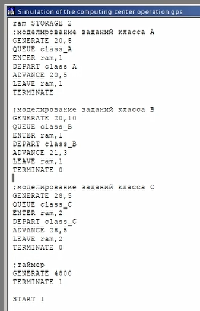{#fig:001 width=30%}

## Моделирование работы вычислительного центра

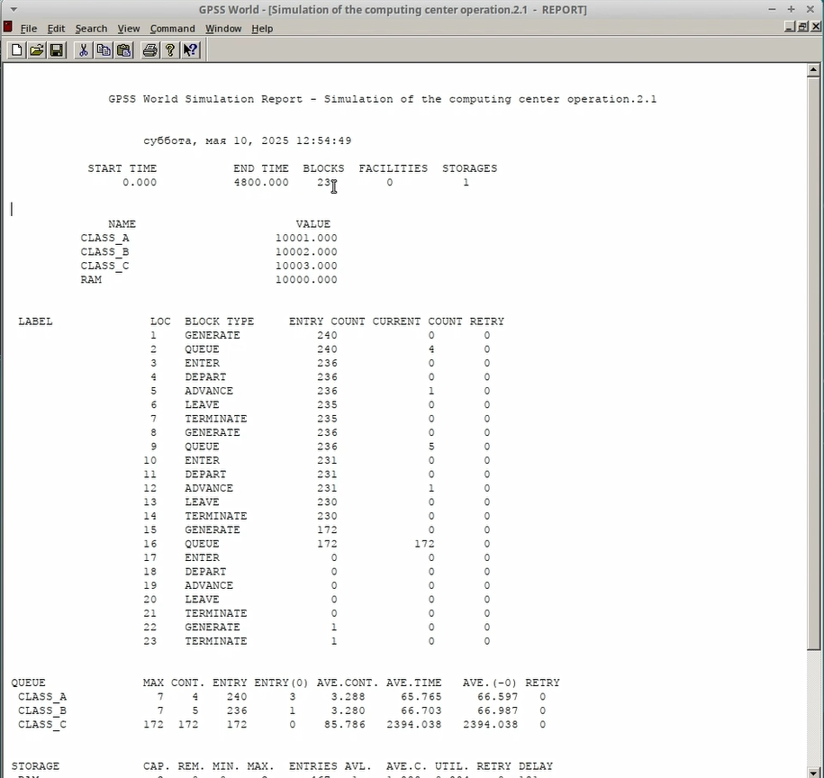{#fig:002 width=50%}

## Моделирование работы вычислительного центра

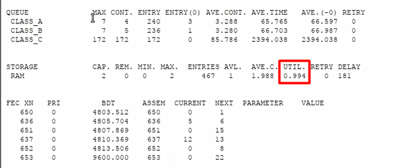{#fig:003 width=70%}

## Модель работы аэропорта

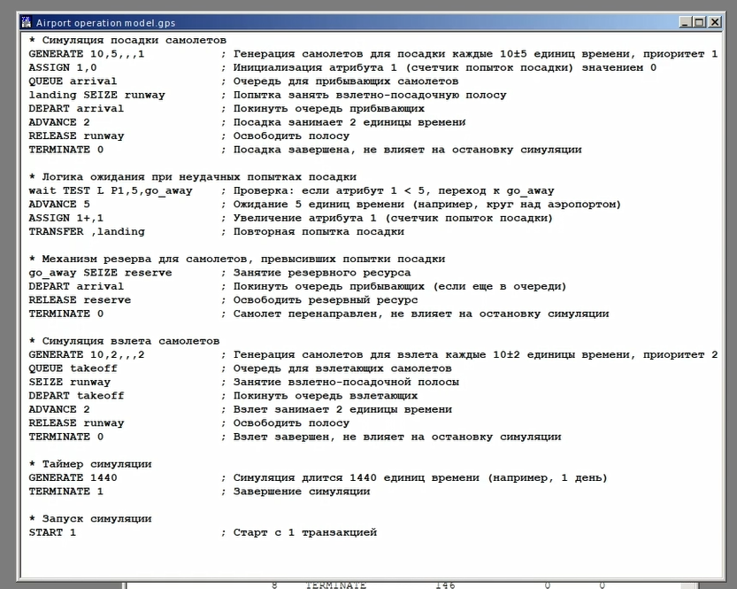{#fig:004 width=50%}

## Модель работы аэропорта

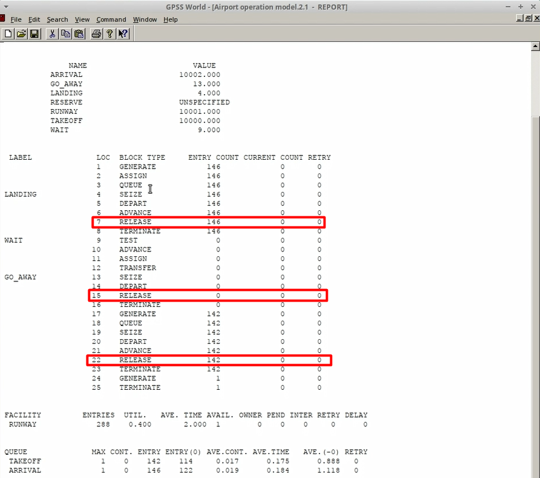{#fig:005 width=40%}

## Модель работы аэропорта

{#fig:006 width=90%}

## Моделирование работы морского порта

Рассмотрим два варианта исходных данных:

1) $a = 20$ ч, $\delta = 5$ ч, $b = 10$ ч, $\varepsilon = 3$ ч, $N = 10$, $M = 3$;
2) $a = 30$ ч, $\delta = 10$ ч, $b = 8$ ч, $\varepsilon = 4$ ч, $N = 6$, $M = 2$.

## Моделирование работы морского порта. Первый вариант модели

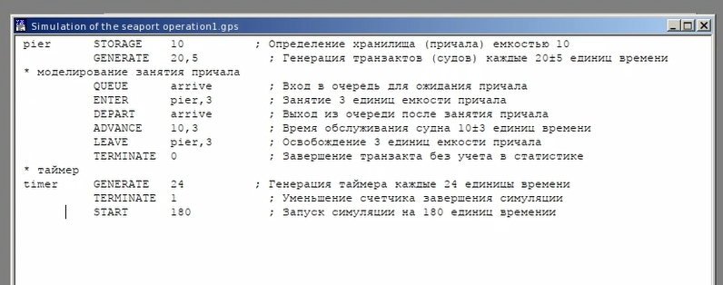{#fig:007 width=60%}

## Моделирование работы морского порта. Первый вариант модели

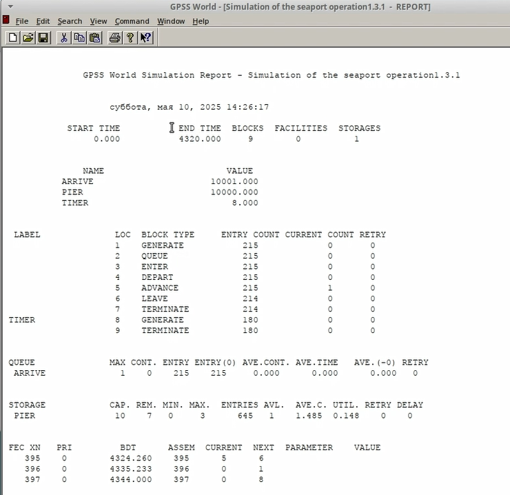{#fig:008 width=50%}

## Моделирование работы морского порта. Первый вариант модели

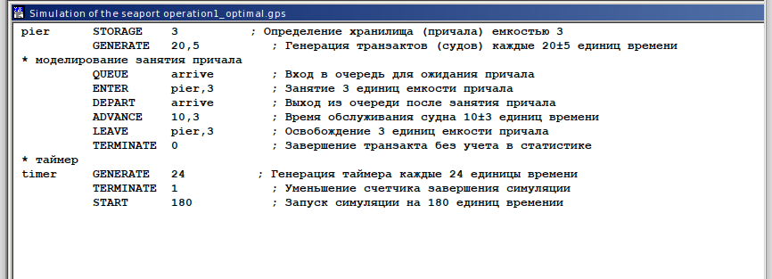{#fig:009 width=60%}

## Моделирование работы морского порта. Первый вариант модели

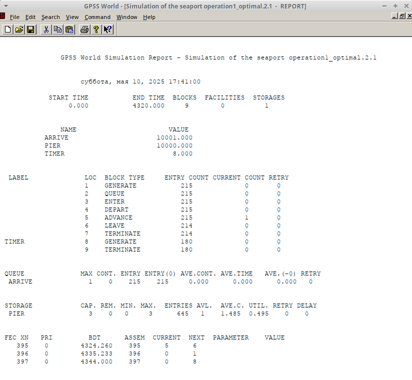{#fig:010 width=50%}

## Моделирование работы морского порта. Второй вариант модели

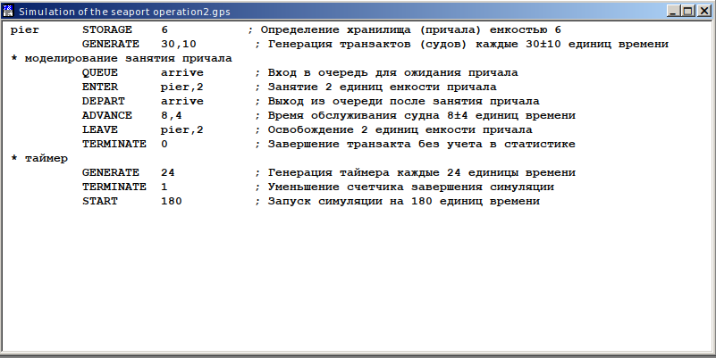{#fig:011 width=50%}

## Моделирование работы морского порта. Второй вариант модели

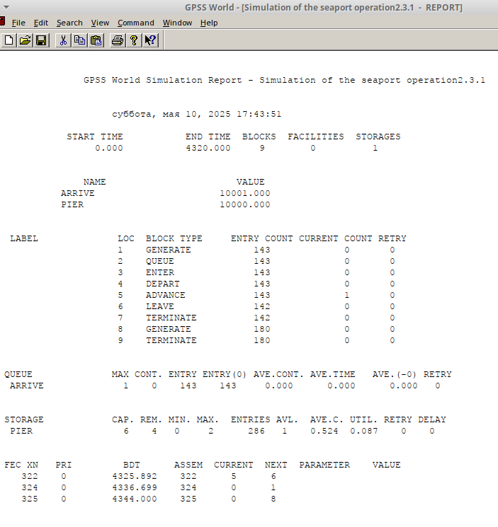{#fig:012 width=40%}

## Моделирование работы морского порта. Второй вариант модели

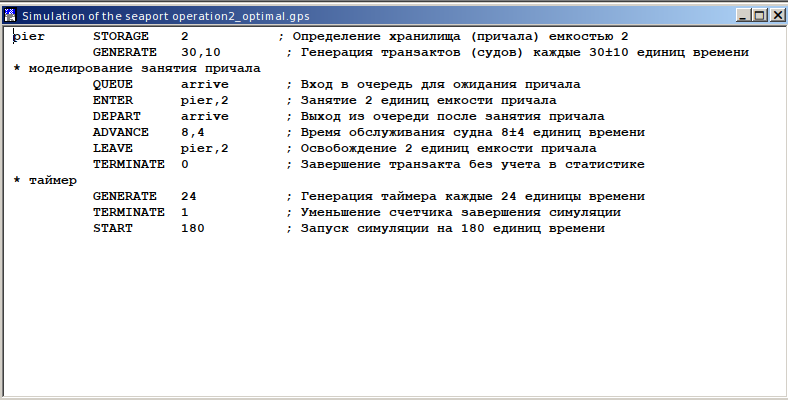{#fig:013 width=50%}

## Моделирование работы морского порта. Второй вариант модели

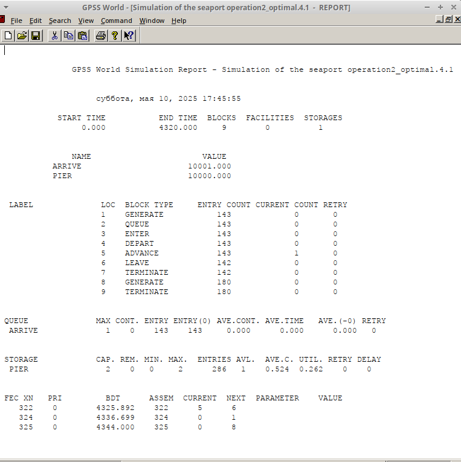{#fig:014 width=40%}

## Выводы

В результате выполнения данной лабораторной работы были реализованы с помощью gpss:

- модель работы вычислительного центра;
- модель работы аэропорта;
- модель работы морского порта.
